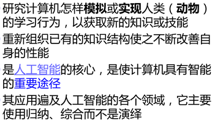

[toc]

# 简介和决策树

## 关于机器学习

机器学习是**寻找一种对自然/人工主题、现象或活动可预测且/或可执行的及其理解方法。**

研究算法需要满足**PTE**

​    P：提高它的性能

​    T：在某项任务中

​    E：利用一些经验  

  

### **机器学习的一般泛型**

​	**监督学习**
$$
Given \space D=\left\{X_i,Y_i\right\},learn \space F(\cdot;\theta),s.t:Y_i=F(X_i) \space D^{new}=\left\{X_j\right\}\Longrightarrow \left\{Y_j\right\}
$$
​	**非监督学习**
$$
Given \space D=\left\{X_i\right\},learn \space F(\cdot;\theta),s.t:Y_i=F(X_i) \space D^{new}=\left\{X_j\right\}\Longrightarrow \left\{Y_j\right\}
$$
​	**强化学习**
$$
Given \space D=\left\{env, actions, rewards, simulator/trace/real \space game\right\}\\
learn \space policy:e,r\rightarrow a, utility:a, e \rightarrow r, \space s.t \left\{env, new\space real\space game\right\}\Longrightarrow a_1,a_2,a_3\dots
$$

## 决策树

决策树可以表示输入属性的任何函数

如果对训练数据中的**每个样例都建立一条从根到叶的路径**（除非f对于输入x是不确定的）就得到一个一致的决策树，但其可能没有**泛化能力**

s.t ​**希望找一个更加紧凑（小规模）的决策树**

### **Top-Down的决策树归纳算法**

Main loop:

1. A <==下一个结点node的最好属性
2. 把A作为决策属性赋给结点node
3. 把A的每一个取值，创建一个新的儿子结点node
4. 把相应训练样本分到叶结点
5. 如果训练样本被很好分类，则停止，否则在新的叶结点上重复上述过程

### 贪心策略

基于一个可以最优化某项准则的属性来切分示例集合

#### 确定待测条件

​	